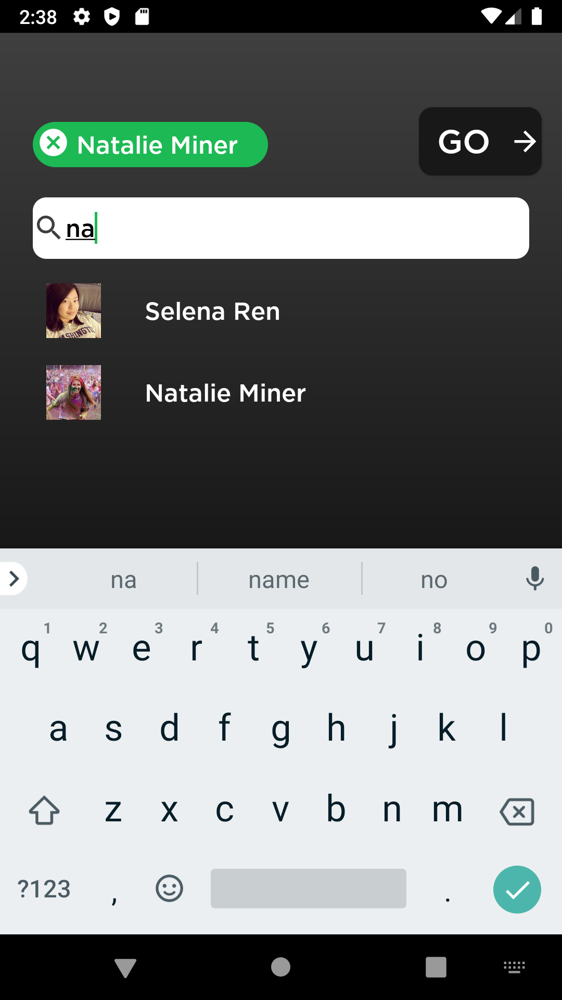
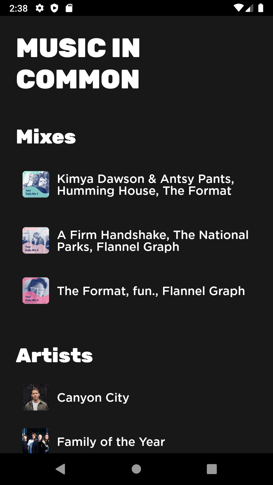
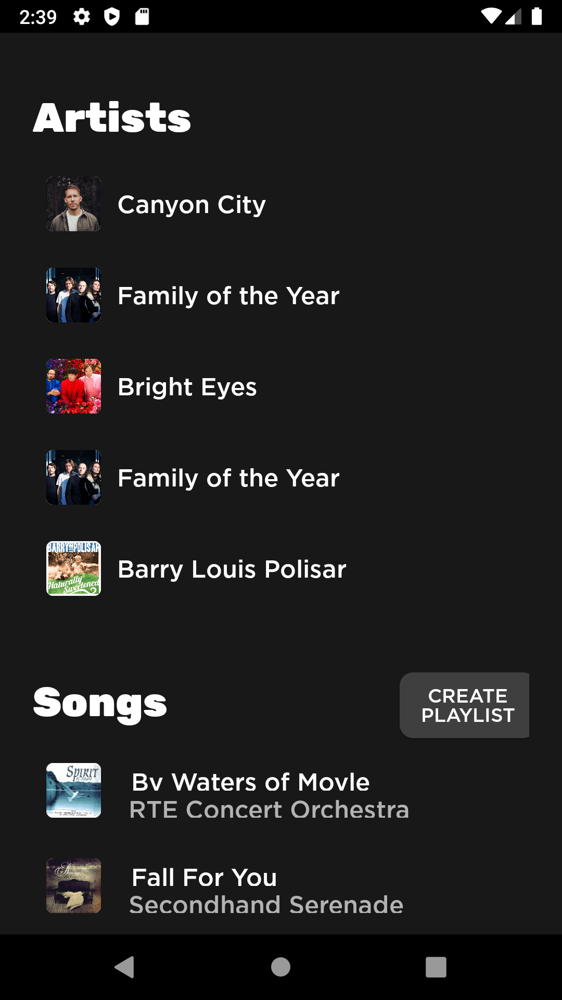

# Spotify-Friends
An Android application that allows users to see the music they have in common with their friends. 

It can be very difficult for two Spotify users to figure out what sort of music they both like. This can make it awkward when one listens to Spotify in a group setting- the 
person choosing the music doesn't know if everyone else likes their music, and everyone else has to go along with whatever they choose. 

Spotify Friends is a companion app to Spotify that solves this problem. Using the Spotify API, it gathers music data from a user and their friends and creates playlists
 with the music that they have in common. This allows users to quickly create a listening experience that is good for everyone, and allows users to have a deeper conversation 
 about the music they love. 
 
 ## Search:
 

 
 
 

 
 ## Results:
 

 
 

### Notes on running Spotify Friends:

This app is a proof of concept, not a complete product. The Spotify API does not allow for searching users by username, so the list of other people that a user can connect with is constrained
to users that they are connected to in some way- either by following their playlists, or by being part of a collaborative playlist with them. 
